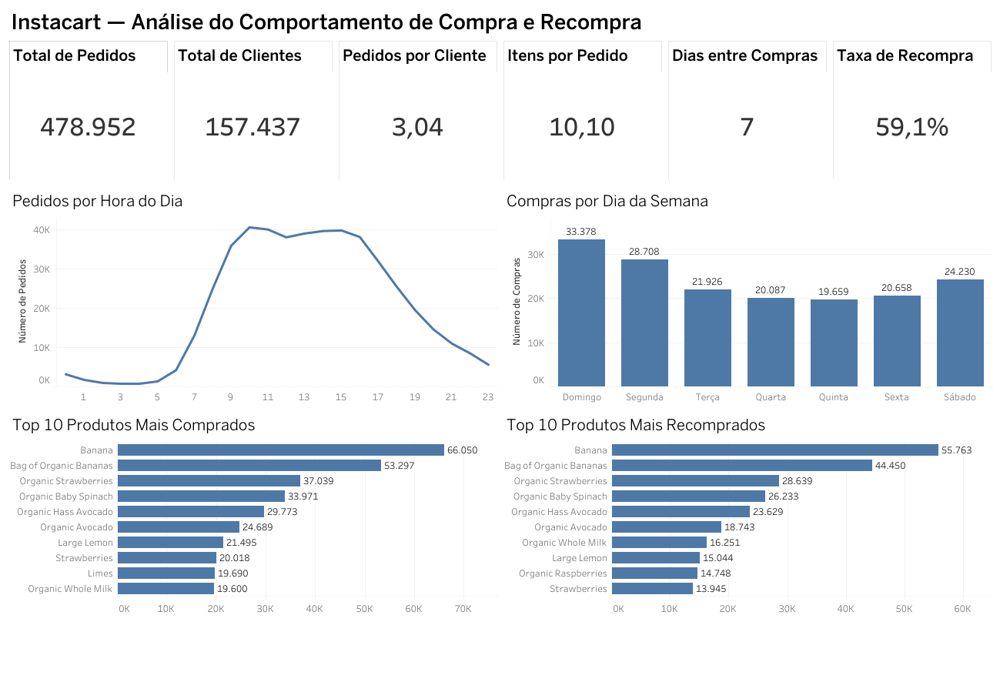

# Instacart — Análise do Comportamento de Compra e Recompra

Projeto de análise exploratória de dados desenvolvido para identificar padrões de compra, frequência de pedidos e comportamento de recompra dos clientes da Instacart.

A análise foi realizada em Python e complementada com um dashboard interativo desenvolvido no Tableau Public.

## Dashboard



### 🔗 Dashboard interativo

[Visualizar dashboard no Tableau Public](https://public.tableau.com/app/profile/giovani.vitor/viz/instacart_17904587522810/DashboardInstacart?publish=yes)

---

## Objetivo do projeto

O objetivo deste projeto foi analisar o comportamento de compra dos clientes da Instacart e responder questões relacionadas a:

- horários com maior volume de pedidos;
- dias da semana com maior atividade;
- frequência de pedidos dos clientes;
- quantidade média de produtos por pedido;
- intervalo entre compras;
- produtos mais comprados;
- produtos com maior número de recompras;
- comportamento geral de recompra.

---

## Principais indicadores

| Indicador | Resultado |
|---|---:|
| Total de pedidos | 478.952 |
| Total de clientes | 157.437 |
| Média de pedidos por cliente | 3,04 |
| Média de itens por pedido | 10,10 |
| Mediana de dias entre compras | 7 dias |
| Taxa aproximada de recompra | 59,1% |

---

## Principais insights

A análise mostrou que o volume de pedidos cresce significativamente durante a manhã e permanece elevado entre aproximadamente **10h e 16h**.

Os maiores volumes de compras ocorrem no **domingo e na segunda-feira**, enquanto os demais dias apresentam uma distribuição mais equilibrada.

Entre os produtos analisados, **Banana** e **Bag of Organic Bananas** aparecem tanto entre os produtos mais comprados quanto entre os mais recomprados.

A taxa geral aproximada de recompra foi de **59,1%**, indicando uma participação relevante de produtos que já haviam sido adquiridos anteriormente pelos clientes.

A mediana de **7 dias entre compras** também sugere um padrão recorrente de compras semanais entre parte dos consumidores.

---

## Tecnologias utilizadas

- Python
- Pandas
- Matplotlib
- Jupyter Notebook
- Tableau Public
- Git / GitHub

---

## Etapas da análise

1. Exploração inicial dos dados
2. Identificação e tratamento de valores ausentes
3. Identificação e remoção de registros duplicados
4. Análise do comportamento temporal dos pedidos
5. Análise da frequência de compra dos clientes
6. Análise dos produtos mais comprados
7. Análise dos produtos mais recomprados
8. Construção de indicadores de negócio
9. Desenvolvimento do dashboard no Tableau

---

## Notebook

O notebook contém todo o processo de preparação, exploração e análise dos dados.

[📓 Acessar o notebook do projeto](instacart_analysis_portfolio.ipynb)

---

## Estrutura do repositório

```text
instacart-data-analysis/
│
├── README.md
├── instacart_analysis_portfolio.ipynb
│
└── painel/
    ├── dashboard_instacart.png
    └── tableau_link.txt
